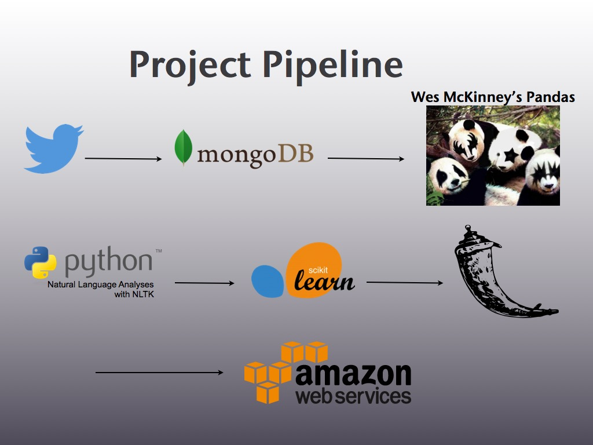
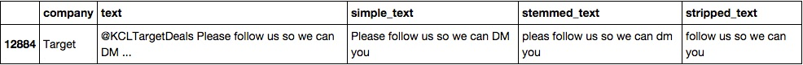
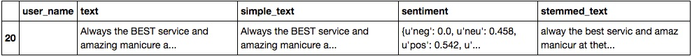
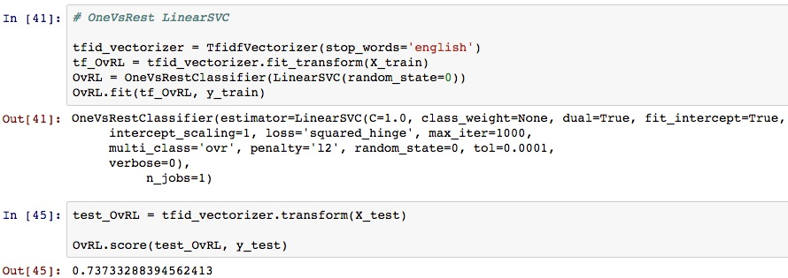
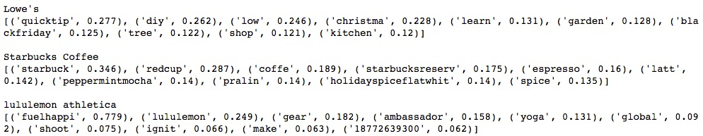

beGifted
======
A recommender which makes personalized gift card recommendations based on a user's Twitter history. An individual can go to the web app, enter in a Twitter account of someone they need to buy a gift for and the model will produce the top three recommendations for that Twitter user.

## Table of Contents
1. [Motivation](#motivation)
2. [Project Pipeline](#pipeline)
3. [Data](#data)
4. [Model](#model)
5. [Web App](#web-app)
6. [Improvements](#improvements)

## Motivation
Whether it is due to the holidays or a personal accomplishment, people love to gift in order to show their appreciation for one another. Just for the 2015 holiday season, it is estimated that the average person in the United States will spend [$830 on gifts and that figure rises to $908](http://www.gallup.com/poll/186620/americans-plan-spending-lot-christmas.aspx) when excluding those who won’t be spending at all. Although our hearts are often in the right place, sometimes it can be a daunting process to find the right present for someone making it awkward for both the giver and receiver when an unwelcome surprise is revealed from beneath paper and ribbons. It is difficult for us to think from the perspective of the recipient and often, the giver is motivated by their own preferences while shopping for another person. There is also the ordeal of which type of gift to purchase and remembering whether or not the recipient already owns the item.

According to a 2013 poll, about 39% of items purchased around the holidays are for “picky” individuals. Cash often feels impersonal and gift cards can make the best gift since they have the flexibility of cash, but are given and spent like gifts. [MasterCard’s 2013 survey](http://www.spsp.org/news-center/press-releases/psychology-gift-giving-and-receiving) showed that 43% of consumers prefer to receive a gift card to purchase hedonic items instead of everyday items because they are able to indulge without feeling guilty. However, choosing which retailer proves to be difficult since so many retailers offer their own [gift cards (closed loop) and choosing a VISA gift card (open loop) is too similar to cash which can be seen as a lack of intimacy and thought]( http://blog.motivemetrics.com/the-psychology-of-holiday-gifts-are-gift-cards-impersonal-or-appreciated).
To produce a less stressful process for the purchaser and a more enjoyable gift for the recipient, analyzing the recipient’s social media can lead to subtle hints revealing retailers who align with their interests.

## Pipeline

#### <u>Stage 0
Research on popular retailers who are widely available throughout the US. To name a few resources: [National Gift Card](http://www.ngc-group.com/), [CardHub](http://www.cardhub.com/edu/8-things-to-know-about-gift-cards/), and [GiftCardNanny](http://www.giftcardgranny.com/statistics/). This resulted in companies.txt which contains the names and Twitter Handles of all the retailers in beGifted

#### <u>Stage 1
Twitter was chosen as the social media to scrape and base the recommender on because Twitter is simple to use and each Tweet is limited to 140 characters resulting in concise, to the point messages. Retailers and random users were scraped from Twitter using [Tweepy](https://github.com/tweepy/tweepy) See get_tweet_history.py. Random users were found with get_random_tweets.py

#### <u>Stage 2
Store the Tweets as .json objects in MongoDB. See get_tweet_history.py and set the user flag to False in twitter_scrape()

#### <u>Stage 3
In Pandas, conduct EDA and data cleaning

#### <u>Stage 4
Using NLTK, analyze the sentiment (polarity score) of each user's tweets with [Vader](http://www.nltk.org/_modules/nltk/sentiment/vader.html) which results in a breakdown of how neutral, negative, and positive a Tweet is where the sum of all three is 1. Only non-negative Tweets ('neg' < .45 -- this cutoff was made subjectively due to time limitations) from the user are included in the analysis for gift card recommendations. This prevents any recommendations being made based on negative Tweets.

#### <u>Stage 5
Three different models were built and cross-validated in sci-kit learn. The best performing model was OneVsRest(LinearSVC()) which consistently returned an accuracy score of ~72%

#### <u>Stage 6
A Web App was built with Flask. See app/bootstrap directory and Web App in Table of Contents for additional information

#### <u>Stage 7
Eventually, have Web App built in Stage 6 to be hosted on AWS

## Data

#### Retailers
The data for retailers was straight forward to obtain after the Twitter Handles were identified manually. Once all retailers were in MongoDB, the Tweets were read into a Pandas dataframe and any Tweet that was a reply were filtered out. Replies were excluded because they were often customer service related issues where the frequently used words were "sorry", "please", "thank", "dm", etc which were not specific to a certain retailer. The remaining Tweets were **stemmed** with SnowballStemmer then **stripped** of superfluous terms. An example of what the retailers' dataframe looks like after it has been cleaned:

#### Users
The Tweets for a specific user are scraped, **simplified** (links removed), analyzed/filtered for **sentiment**, then **stemmed** with SnowballStemmer. The stemmed_text is then aggregated into a single document to be utilized by the model.

## Model
#### Training and Testing
The model utilized by beGifted is the [OneVsRestClassifier](http://scikit-learn.org/stable/modules/generated/sklearn.multiclass.OneVsRestClassifier.html) with [LinearSVC](http://scikit-learn.org/stable/modules/generated/sklearn.svm.LinearSVC.html). All the Tweets from retailers were split into training and testing sets. The Tweets in the training set were fed into a TFIDF vectorizer and fit to the OneVsRest model with the company's name as the label. The model then predicted on the testing set with an accuracy of 73%.

INSERT ROC CURVE GRAPH

#### Important Features
The model identified important features for each retailers in order to make recommendations, below is a snippet of the top 10 words for three of the retailers

#### Predictions from Decision Function
When predictions are made for a Twitter user, the user's stemmed_text is aggregated into a single document and transformed into a TFIDF to be used by the model.

The LinearSVC classification model's predict() only returns a single class. In order to obtain the top 3 most likely classes (retailers) for each user, the decision_function() was called instead of predict() -- see twitter_predictions() in run_app.py.

## Web App
To see how the Web App works, please look at the .ppt file in the images folder for a demonstration.

To run the Web App locally, simply type:

*from the app/bootstrap directory*
 python build_model.py     <b> This will take a few minutes to run </b>
 python run_app.py <b>Then in your browser, type 'localhost:8080' </b>

## Improvements
1. Add more retailers (currently at ~75 retailers)
2. Scrape additional sources for more accurate features like the websites of each company
3. Incorporate other social media outlets (Instagram, Facebook, etc)
4. Continuously include new Tweets from retailers
5. Use retailers’ followers as labeled data
